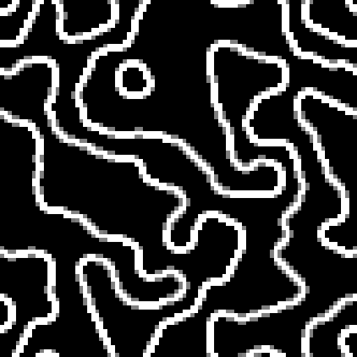

# wave-function-collapse
Wave function collapse implemented in Processing

I originally saw this here: https://discourse.processing.org/t/wave-collapse-function-algorithm-in-processing/12983
and then at: https://github.com/mxgmn/WaveFunctionCollapse

Known issue: sometimes the sequence will stop and flood the remaining area with null markers, presumably when a contradiction occurs but I have been unable to catch it.
Unfortunately, I have yet to implement a good method to recover as restarting where the program left off leads to the same result. Other methods may no longer align generated output (depending on patterns).

The file "waveFuncLetters.pde" is a very simple word-search-builder. The algorithm lends itself very well with some input and filling in the rest.

A few examples:
https://youtu.be/THvTgZZEeOU

Example input:

Example output:

